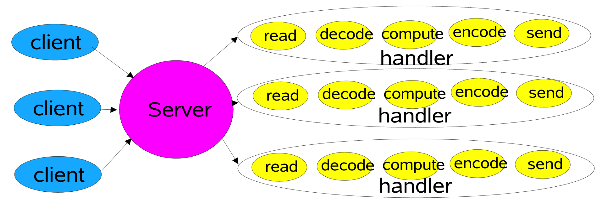

本module主要针对的计算机网络处理模型进行学习，包括

+ 计算网络知识
+ Java I/O处理模型
+ Netty原理的解析

更多内容欢迎访问本人的技术博客 [燕归来兮](https://www.zhoutao123.com)

---


网络通信的基本模型是C/S模式即 客户端-服务端 模式，客户端通过和服务端建立连接实现通信。
因此服务端绑定某个端口, 并监听此端口的连接信息，在传统的BIO线程模型中 ServerSocket 负责绑定IP和端口，监听连接；Socket则负责发起连接操作，双方在建立连接之后等待数据传输


## 1、Java BIO线程模型




```java
    ServerSocket socket = new ServerSocket();
    socket.bind(new InetSocketAddress(9090));
    while (true) {
      // 阻塞操作，等待连接
      Socket accept = socket.accept();
      // 接收到连接后创建线程处理数据
      new Thread(
          () -> {
            try (InputStream stream = accept.getInputStream()) {
              BufferedReader reader = new BufferedReader(new InputStreamReader(stream));
              String s = reader.readLine();
              System.out.println("接收数据:" + s);
            } catch (IOException e) {
              e.printStackTrace();
            }
          })
          .start();
    }
```

## 2、Java BIO 线程池优化模型

在接收到大量连接的请示，程序会创建大量的线程，而线程则是系统中非常重要的资源，创建大量的线程可能会造成系统卡顿等问题
因此创建了使用线程池优化的方案，但是即使使用线程池也没有从本质上解决大量请求的问题。

```java
private void handleBIOWithThreadPool()throws IOException{
    ExecutorService executor=Executors.newFixedThreadPool(10);
    ServerSocket socket=new ServerSocket();
    socket.bind(new InetSocketAddress(9091));
    while(true){
    Socket clientSocket=socket.accept();
    executor.submit(new SocketTask(clientSocket));
    }
    }

// 线程池任务
static class SocketTask implements Runnable {

  private Socket socket;

  public SocketTask(Socket socket) {
    this.socket = socket;
  }

  @Override
  public void run() {
    try (InputStream stream = this.socket.getInputStream()) {
      BufferedReader reader = new BufferedReader(new InputStreamReader(stream));
      String result = reader.readLine();
      System.out.println("接收到数据:" + result);
    } catch (IOException e) {
      e.printStackTrace();
    }
```

## 3、Java NIO 非Selector 模型

从Java1.4 开始JDK提供了NIO模型，在Linux操作系统中NIO基于Epoll模型实现高效的IO操作。其主要依赖一下三个操作方法

1. epoll_create 创建epoll线程模型,底层是epoll示例与红黑树模型
2. epoll_ctl 向epoll实例中注册需要监听的文件描述符，文件描述符以红黑树的行书保存
3. epoll_wait(timeout) 等待epoll模型中出现时间，比如连接事件以及可读事件

但是在Linux 2.4 之前，Linux系统一直使用的select线程模型，而非epoll模型。select模型与epoll模型最大的区别是:

+ select 在接收收到注册的时间后，需要遍历所有的连接，从中过滤出有效的连接才能进行处理，这对存在大量连接，但是活跃的连接很少的情况下效率非常低。
+ epoll 则需要要在连接的时候想Selector 注册感兴趣的事件，当事件触发的时候(系统中断)，则将其移到另外一个集合中，业务通过遍历此集合来提高效率。

> 对于Windows操作系统而言，JavaNIO使用的线程模式是闭源的 win2sock, epoll 是Linux专属的线程模型

```java
    ServerSocketChannel channel = ServerSocketChannel.open();
    channel.bind(new InetSocketAddress(9091));
    channel.configureBlocking(false);
    System.out.println("服务启动成功.....");
    while (true) {
      SocketChannel accept = channel.accept();
      if (accept != null) {
        System.out.println("连接成功");
        accept.configureBlocking(false);
        channelList.add(accept);
      }

      // FIXME: 需要处理所有的连接，连接越多性能越差，每次循环有大量的空转操作
      Iterator<SocketChannel> iterator = channelList.iterator();
      while (iterator.hasNext()) {
        SocketChannel socketChannel = iterator.next();
        ByteBuffer buffer = ByteBuffer.allocate(128);
        int read = socketChannel.read(buffer);
        if (read > 0) {
          System.out.println("接收到数据:" + new String(buffer.array()));
        } else if (read == -1) {
          System.out.println("连接断开");
          iterator.remove();
        }
      }
    }
```


# Netty 零拷贝

JVM通常在堆内存上创建对象，而一部分代码通常会在操作系统上创建直接内存，非JVM分配的内存

```java
ByteBuffer buffer = ByteBuffer.allocate(128);
```

